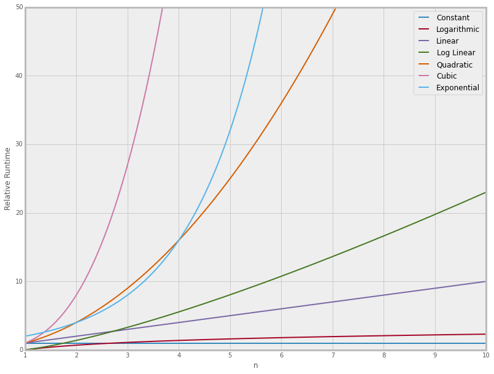

Oh, Big O. Big O is one of those concepts that I've always said "yeah, sure I get that" but every time I revisit it, I'm like BUT WHY.


As I've gotten older, I've been able to understand it a little better. I say "as I've gotten older" because with some experience behind my belt I've been able to grasp why we use Big O to determine the efficiency of an algorithm


I'll try my best to explain it and hopefully it'll make more sense to those that are still confused by the topic.

One graph I really appreciate is this one:


(The graph is from Jose Portilla's course on Data Structures and algorithms on Udemy)

What exactly are we looking at? We see that the x-axis of the graph is labeled `n` and the y-axis is labeled 'relative runtime.'

That means, as `n` increases, so does their runtime, for the most part.

With Big O, we are measuring how fast an algorithm _grows_. That can sound confusing at first so let's go through some examples of the most common Big O's.

### O(1) or Constant

`O(1)`, also known as _constant_ runtime means that no matter how big `n` is, the runtime will remain well, constant.

Here is an example of a `O(1)` runtime:

```
def constant_bigo(elements):
    result = elements[0] * elements[0]
    print()

constant_bigo([4, 5, 6, 8])
```

This piece of code runs in `O(1)` time because we are multiplying `items[0] * items[0]` and then printing the value. It doesn't matter how big the list of items is because we will always multiply the first item by itself. In this case `4 * 4` which is `16`.

### O(n) or Linear

```
def linear_bigo(elements):
    for i in elements:
        print(i)
linear_bigo([1,2,3,4,5,6,7,8,9,10])
```

This piece of code is `O(n)`. Depending on how many elements are in the input, will be the amount of times the for loop executes. If there are 10 elements in the elements array, the for loop will execute 10 times.

If there are 1,000,000 elements in the elements array, the for loop will execute 1,000,000 times.

Let's quickly take a look at the graph I presented earlier in this post. Our code for `O(n)` takes in some arbitrary amount of elements. For our example, let's say the input is 10 elements in some array.

If we look at the graph, if `n` is equal to 10 then the relative runtime or the amount of operations is also 10. This is why we say that the function increases _linearly_ with direct proportion to the number of inputs.

### O(log n) or Logarithmic

`O(log n)` means that the complexity of your algorithms increases _logarithmically_ in relation to your input size.

That sounds weird. What does it it mean to "increase logarithmically."

Wikipedia says:

> The idea and purpose of logarithms is also to undo a fundamental arithmetic operation, namely raising a number to a certain power, an operation also known as exponentiation. For example, raising 2 to the third power yields 8, because 8 is the product of three factors of 2:</br>
> 2 <sup>3</sup> =2 x 2 x 2 = 8</br> The logarithm (with respect to base 2) of 8 is 3, reflecting the fact that 2 was raised to the third power to get 8.

The most famous`O(log n)` algorithm is binary search.

In binary search, you start with a list of sorted elements and you are trying to find some item within the list. You begin by locating the middle element, and from there you determine if the item you are looking for is smaller or larger than the middle element.

Once you have figured that out, you get rid of one half of the elements! You keep doing this until you find the element you are looking for.

This means, with each iteration you are cutting down the amount of elements in half. This is a win for performance.

Binary Search Example:

Let's say you have 32 elements in your array. It will take 5 passes to find your element because

log<sub>2</sub>32 = 5

Only 5 passes for a list of 32 elements, that's pretty impressive. When we look at our graph and see `O(log n)` we see that the line grows very slowly because as our input size grows arbitrarily we are still maintaining an efficient runtime.

### O(n<sup>2</sup>) or Quadratic

```
def linear_bigo(elements):
    for i in elements:
        for j in elements:
            print(i,j)
linear_bigo([1,2,3,4])
```

Here we have a nested loop. Let's run through this code. We start with our outer for loop so `i = 0`. Then we move to our inner loop where `j=0` as well. Now we print `0 0`. Our inner loop keeps running until we are at the end of the list. Once we are at the end of the list, we iterate `i` again so `i=1`.

Our output will look like this </br>
`1 1` </br>
`1 2` </br>
`1 3` </br>
`1 4` </br>
`2 1` </br>
`2 2` </br>
`2 3` </br>
`2 4` </br>
... and the program continues until our last output is `4 4`.

What is happening here? The inner loop will run `n` times for each iteration of our outer loop. This gives us a complexity of `n*n` or `O(n^2)`.

`O(n^3)` would be similar.

```
def linear_bigo(elements):
    for i in elements:
        for j in elements:
            for k in elements:
            print(i,j,j)
linear_bigo([1,2,3,4])
```

The out output would look like </br>
`1 1 1` </br>
`1 1 2` </br>
`1 1 3` </br>
`1 1 4` </br>
`1 2 1` </br>
`1 2 2` </br>
`1 2 3` </br>
`1 2 4` </br>
... and the program continues until our last output is `4 4 4`.

If we take a look at our graph for `O(n^2)` we can see as `n` gets bigger the amount of operations increases substantially. This isn't something we want. If our algorithm grows at a high rate, that means that our computer is working very hard to compute the algorithm. We want the least amount of operations as possible.

Hopefully, this post gives some clarity into what big O is. It can be hard to wrap your mind around the concept at first, but if you stare at the words on your screen long enough, good things might happen!


---

Here are some great resources that helped me write this post!

https://stackabuse.com/big-o-notation-and-algorithm-analysis-with-python-examples/

https://www.interviewcake.com/article/python3/big-o-notation-time-and-space-complexity?course=fc1&section=algorithmic-thinking

https://hackernoon.com/what-does-the-time-complexity-o-log-n-actually-mean-45f94bb5bfbf
