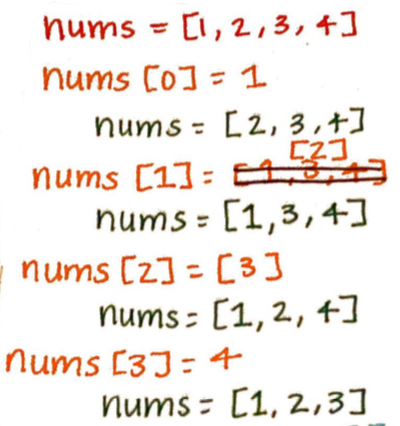
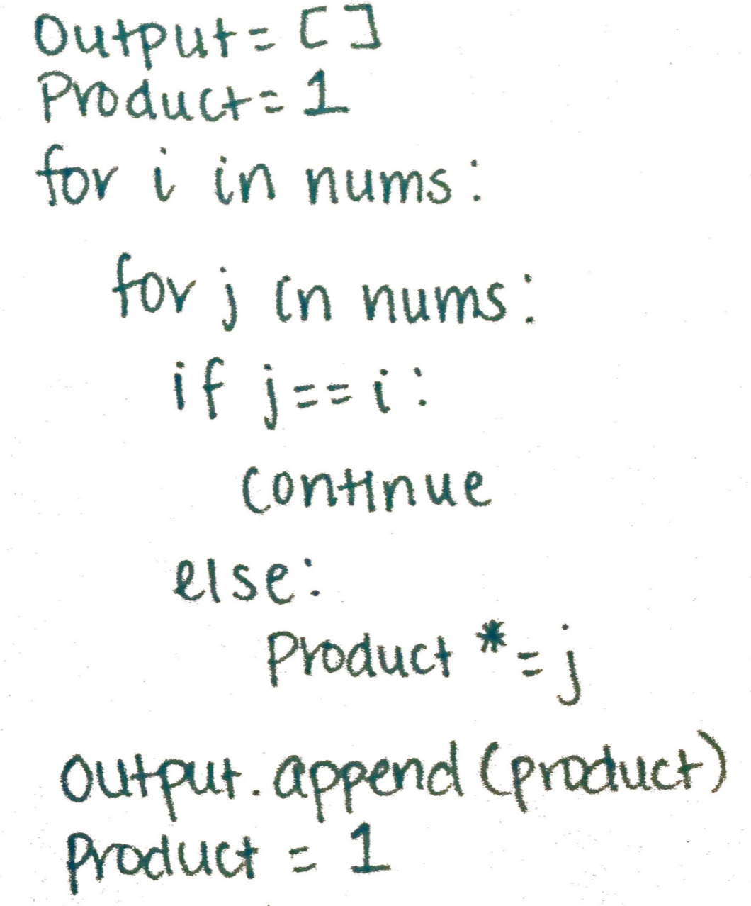
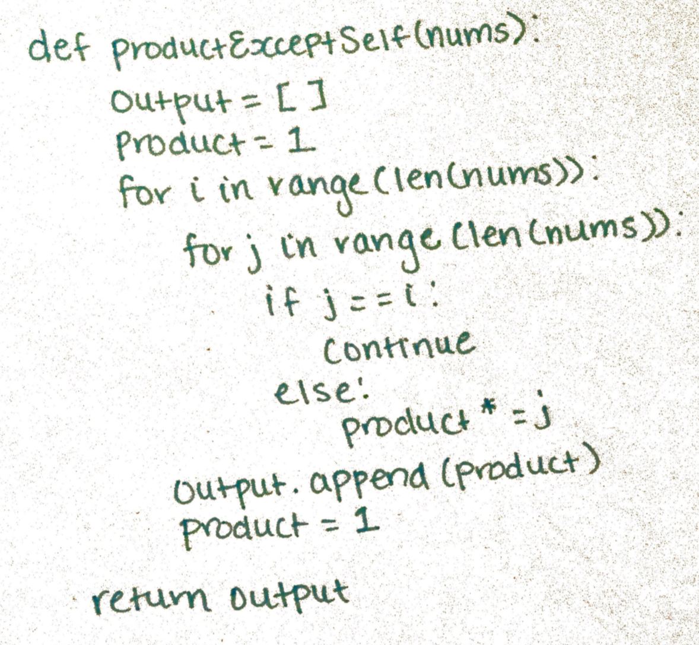
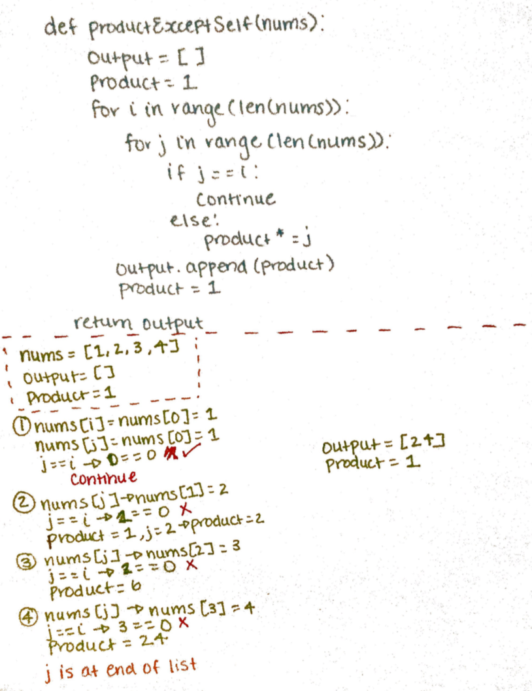

I decided to work on a difficulty: medium style problem on leetcode today because, why not

It went...ok.

I struggle through these problems and usually have a tough time coming up with the optimal solution but it's important to try!

The problem states

> Given an array `nums` of n integers where `n > 1`, return an array output such that `output[i]` is equal to the product of all the elements of `nums` except `nums[i]`.

Example:

> Input: [1,2,3,4]
> Output: [24,12,8,6]

> Note: Please solve it without division and in O(n).

Initially, I wrote some things out.

I wanted to see what the `nums` array would look like when I took `i` out of the array to see if there would be a pattern.

I know the note says to solve the problem in `O(n)` but I couldn't think of a solution in linear time. My initial thought was a nested for loop.

I began to think, I can have `i` and `j` traversing the list and if `j` equals `i`, then I would move `j`. If `j` did not equal `i` then I would multiply it to some already instantiated `product` variable.

Now, I can append each `product` to the `output` array which we are supposed to `return`.

I was really close here (yes, I know I haven't returned the `output` array yet). Where I kept failing

