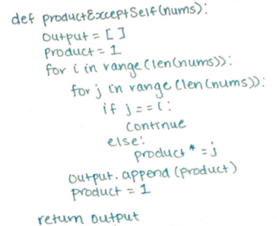

I decided to work on a difficulty: medium style problem on leetcode today because, why not

It went...ok.

I sometimes struggle through these problems and I can have a tough time coming up with the optimal solution but it's important to try!

The problem states

> Given an array `nums` of n integers where `n > 1`, return an array output such that `output[i]` is equal to the product of all the elements of `nums` except `nums[i]`.

Example:

> `Input: [1,2,3,4]`   > `Output: [24,12,8,6]`

> Note: Please solve it without division and in O(n).

Initially, I wrote some things out.

I wanted to see what the `nums` array would look like when I took `i` out of the array to see if there would be a pattern.

I know the note says to solve the problem in `O(n)` but I couldn't think of a solution in linear time. My initial thought was a nested for loop.

I began to think, I can have `i` and `j` traversing the list and if `j` equals `i`, then I would move `j`. If `j` does not equal `i` then I would multiply it to my `product` variable.

The issue I realized here is if you have an input like `[0,0]` and `j` is at position 1 and `i` is at position 0, in that case, `j` does equal `i`. Instead, it's better to loop over the length of the array and check to see if the indicies are the same.

As an example, I went through code and I show you exactly what happens, step by step for the first index of `nums`.

Here are some example inputs and outputs

`input: [1,2,3,4]` 
`output: [24, 12, 8, 6]`

`input: [0,0]` 
`output: [0, 0]`

`input: [1,-1,1,-1,-1,1]` 
`output: [-1, 1, -1, 1, 1, -1]`

`input: []` 
`output: []`

`input: [5, 1, 2, 8, 9]` 
`output: [144, 720, 360, 90, 80]`

`input: [3,4]` 
`output: [4,3]`

The issue with my code is that it takes too long to execute. I had trouble figuring out what the code would look like in linear time, so I had to peek at the solution.

I went through the code line by line using `input: [3,4,5]`.

 

In this solution, we are iterating through the nums array and each time we append the value of `p` to the `output` array. Then, we multiply `p` by the `nums[i]` value.

In each iteration, `p` is multiplied by the current `nums[i]` value and is appended to the `output` array in the next iteration.

In the second for loop, we start at the end of the array. Each iteration, we multiply the current value of `i` in the output array to `p`. Then we set the value of `p` to the value of `p` times the `nums[i]` value.

At the end, we have our `output` array.

This solution is `O(n)` which is better than my `O(n^2)`.

Hopefully this walk through was helpful. I'm planning on doing this weekly. If there are any suggestions on how I can makes these posts more helpful, please let me know!

Here is my code in my code editor with some examples

 

On to the next one!

